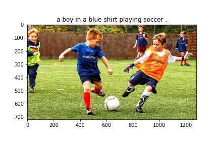

## Image Captioning
Image Captioning is the process of generating textual descriptions of an image. It is a challenging task in the field of computer vision and natural language processing. The goal of Image Captioning is to create a model that can generate a natural language description of an image, which should be accurate, relevant, and semantically meaningful.

This repository contains the code for building an Image Captioning model using Deep Learning. The model is trained on the Flickr30k dataset which contains a large collection of images with corresponding textual descriptions. The model is built using a Convolutional Neural Network (CNN) to extract features from the images and a Recurrent Neural Network (RNN) to generate the textual descriptions.

### Code Explaination
- ``text_processor.py`` : This script takes captions csv file and processes the captions as required by the model.
- ``image_loader.py`` : It loads all the image data in batches and yeilds a generator output.
- ``model.py`` : The architecture of model. The model initially takes image input and extracts the features, which is later fed to LSTM layer along with processed captions.
- ``train.py`` : The training of the model happens here. The input is given from another script ``config.py``.

### Getting Started
1. Clone the repository

```sh
git clone https://github.com/poolkit/Image-2-Text.git
```

2. Download the [Flickr30k](https://www.kaggle.com/datasets/hsankesara/flickr-image-dataset) dataset. Unzip the caption csv file and dump all the images and csv file into ``'data/'`` folder.

3. Install all the required dependencies

```sh
pip install requirements.txt
```

4. To train the model, just run

```sh
python train.py
```

### Results




